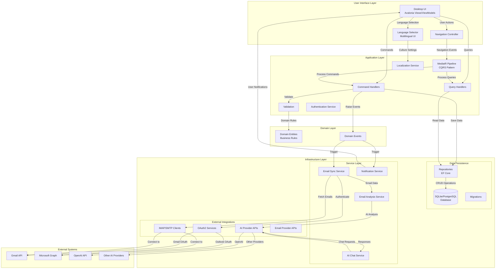
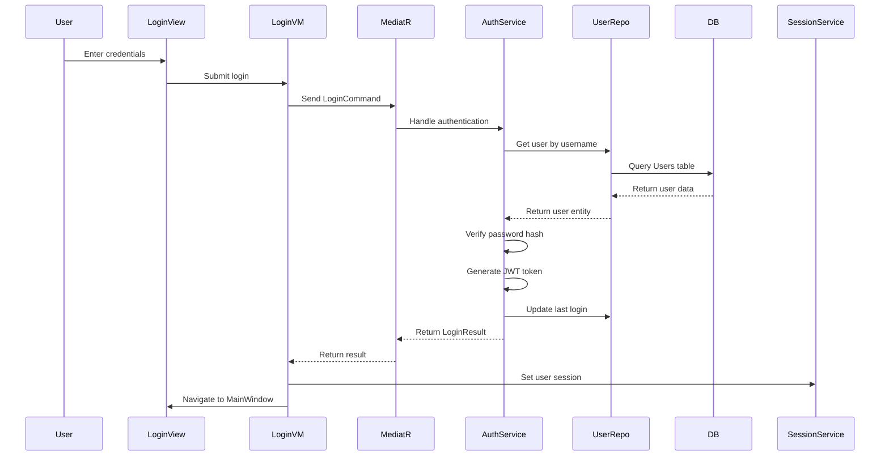
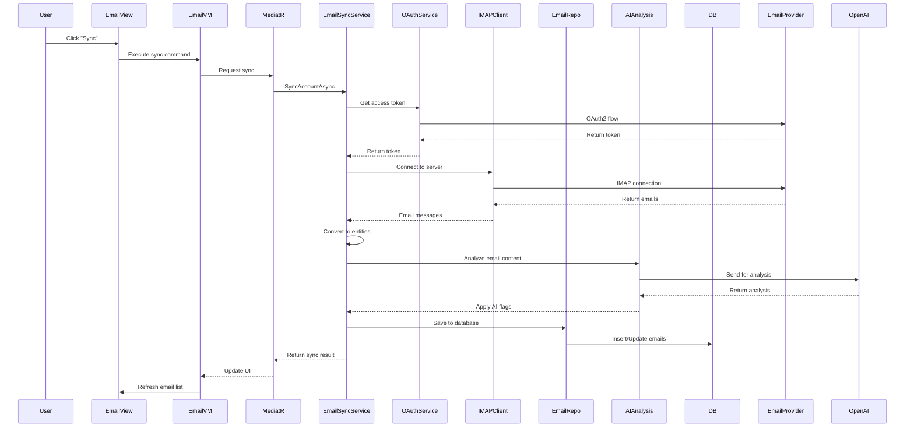
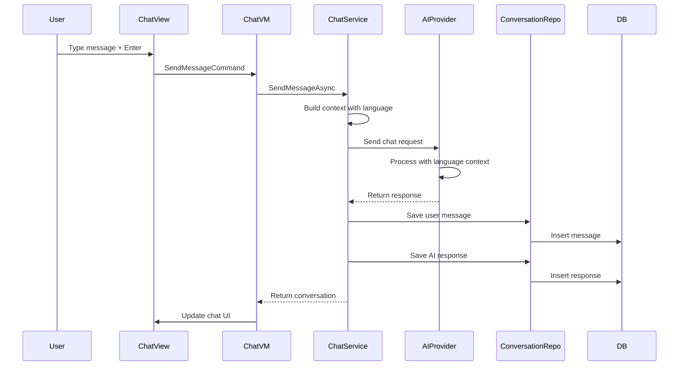
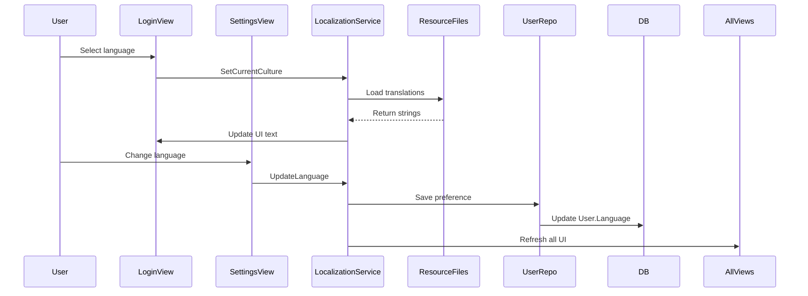
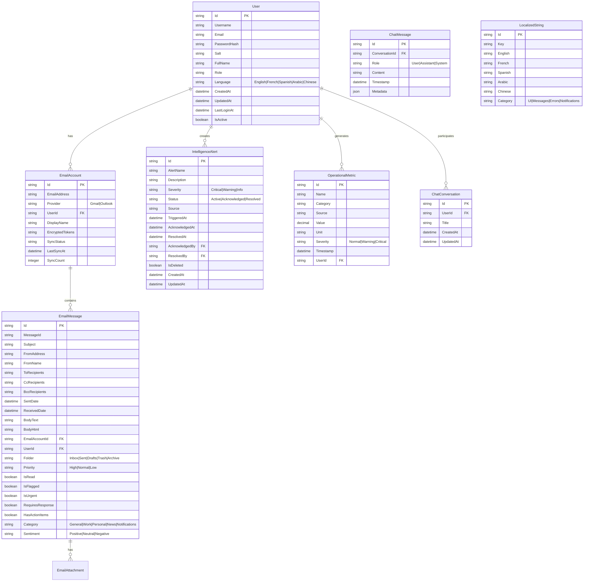

# Data Flow Diagram - Mbarie Intelligence Console (MIC)

## System Architecture Overview



## Detailed Data Flow Descriptions

### 1. Authentication Flow


### 2. Email Synchronization Flow


### 3. AI Chat Flow


### 4. Localization Flow


## Data Storage Schema

### Core Tables


## API Integration Points

### External API Endpoints

#### Gmail API (OAuth2 + REST)
```
POST https://accounts.google.com/o/oauth2/v2/auth
POST https://oauth2.googleapis.com/token
GET  https://gmail.googleapis.com/gmail/v1/users/{userId}/messages
GET  https://gmail.googleapis.com/gmail/v1/users/{userId}/messages/{messageId}
```

#### Microsoft Graph API (OAuth2 + REST)
```
POST https://login.microsoftonline.com/common/oauth2/v2.0/authorize
POST https://login.microsoftonline.com/common/oauth2/v2.0/token
GET  https://graph.microsoft.com/v1.0/me/messages
GET  https://graph.microsoft.com/v1.0/me/messages/{messageId}
```

#### OpenAI API (Chat Completions)
```
POST https://api.openai.com/v1/chat/completions
Headers:
  Authorization: Bearer {api_key}
  Content-Type: application/json
Body:
  {
    "model": "gpt-4",
    "messages": [
      {"role": "system", "content": "Respond in {user_language} language."},
      {"role": "user", "content": "{user_message}"}
    ],
    "temperature": 0.7
  }
```

### Internal Service Interfaces

#### IEmailSyncService
```csharp
public interface IEmailSyncService
{
    Task<EmailSyncResult> SyncAccountAsync(EmailAccount account, CancellationToken ct = default);
    Task<EmailSyncResult> SyncAllAccountsAsync(string userId, CancellationToken ct = default);
    Task<EmailSyncResult> IncrementalSyncAsync(EmailAccount account, CancellationToken ct = default);
}
```

#### IChatService
```csharp
public interface IChatService
{
    Task<ChatResponse> SendMessageAsync(string message, string conversationId, string userLanguage);
    Task<Conversation> GetConversationAsync(string conversationId);
    Task<IEnumerable<Conversation>> GetUserConversationsAsync(string userId);
    Task DeleteConversationAsync(string conversationId);
}
```

#### ILocalizationService
```csharp
public interface ILocalizationService
{
    string GetString(string key);
    string GetString(string key, params object[] args);
    void SetLanguage(string languageCode);
    string CurrentLanguage { get; }
    event EventHandler LanguageChanged;
}
```

#### IAuthenticationService
```csharp
public interface IAuthenticationService
{
    Task<LoginResult> LoginAsync(string username, string password);
    Task<RegistrationResult> RegisterAsync(UserRegistrationDto registration);
    Task<bool> LogoutAsync();
    Task<UserDto> GetCurrentUserAsync();
}
```

## Data Transformation Points

### 1. Email → Entity Conversion
- **Input**: MimeMessage (MailKit)
- **Transformation**: Extract headers, body, attachments
- **Output**: EmailMessage entity
- **Location**: `RealEmailSyncService.ConvertToEntity()`

### 2. Alert Severity Mapping
- **Input**: Raw alert data (numeric/string)
- **Transformation**: Map to enum (Critical=0, Warning=1, Info=2)
- **Output**: AlertSeverity enum
- **Location**: `AlertConverters.Convert()`

### 3. Metric Normalization
- **Input**: Raw metric values from various sources
- **Transformation**: Scale, unit conversion, outlier detection
- **Output**: Normalized OperationalMetric
- **Location**: `MetricsRepository.NormalizeMetric()`

### 4. Localization Lookup
- **Input**: Resource key + language code
- **Transformation**: Database/Resource file lookup
- **Output**: Translated string
- **Location**: `LocalizationService.GetString()`

## Error Handling and Data Flow Recovery

### Retry Logic
1. **Email Sync Failures**: Exponential backoff (1s, 2s, 4s, 8s)
2. **API Rate Limits**: 429 response → wait and retry
3. **Network Issues**: 3 retries with increasing delay

### Data Consistency
1. **Transactional Operations**: Use EF Core transactions for multi-step updates
2. **Idempotent Operations**: Sync operations can be safely retried
3. **Conflict Resolution**: Last-write-wins for email updates

### Monitoring Points
1. **Sync Duration**: Track time per email account
2. **API Latency**: Monitor external API response times
3. **Error Rates**: Track failures by category (auth, network, parsing)
4. **Data Volume**: Count emails synced, alerts created, chat messages

## Performance Considerations

### Data Flow Bottlenecks
1. **Email Sync**: Batch processing (100 emails/batch)
2. **AI Analysis**: Queue-based processing for non-real-time analysis
3. **UI Updates**: Debounced refresh (min 500ms between updates)

### Caching Strategy
1. **Localization Strings**: Memory cache with file watcher
2. **User Session**: In-memory with periodic persistence
3. **Email Metadata**: LRU cache for frequently accessed emails

### Database Optimization
1. **Indexes**: UserId, EmailAccountId, CreatedAt timestamps
2. **Partitioning**: Consider time-based partitioning for email messages
3. **Archiving**: Move old emails to cold storage after 90 days

---

**Document Version:** 1.0  
**Last Updated:** 2026-01-30  
**Author:** Cline (AI Assistant)  
**Status:** Complete