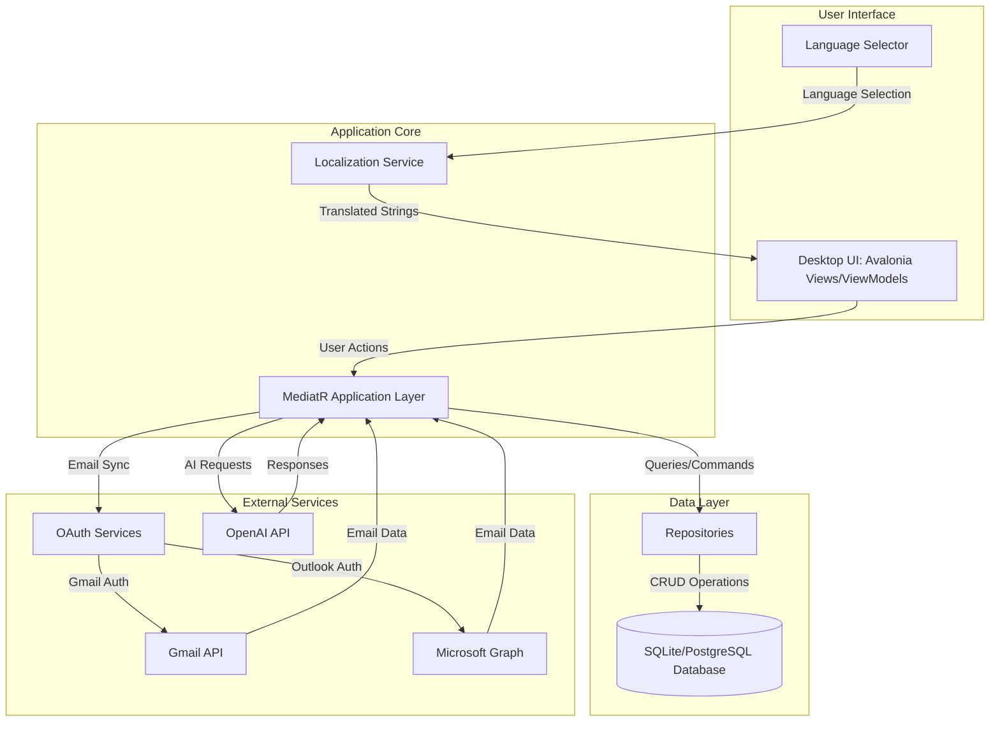

# Feature Requirements Document (FRD) — Mbarie Intelligence Console (MIC)

**Scope:** Wire all currently-present UI buttons/commands to real services and real persisted data. Remove all demo/mock behavior. Establish clear navigation, persistence, and success criteria per feature area. Implement multilingual support (English, French, Spanish, Arabic, Chinese) from the beginning.

**Target state:** The desktop app is fully interactive:
- Every button performs a real action.
- Every view reads/writes real data (DB and/or external APIs).
- Authentication is real (no demo bypass).
- Settings persist and either reconfigure live or prompt restart.
- Data integrity and error handling are production-grade.
- Full multilingual support with localization from the start.

---

## 1. Current State (Diagnostics Summary)

### Stable foundation
- Solution compiles and app runs.
- ReactiveUI threading crash ("Call from invalid thread") addressed via `Avalonia.ReactiveUI` + `RxApp.MainThreadScheduler`.
- Clean Architecture layers established (Domain, Application, Infrastructure, Desktop).
- Basic UI components and navigation framework exist.

### Functional gaps (must be resolved)
- Navigation highlight state incorrect.
- Most buttons are no-op.
- Demo user bypass still active (`App.axaml.cs`).
- No reliable close button behavior.
- Email account registration (OAuth) not reachable or not implemented end-to-end.
- AI settings (API key) not persisted into runtime configuration for services.
- Metrics view layout/scroll issues.
- Chat: Enter-to-send not wired; service integration must be real.
- **No multilingual support** - all UI text is hardcoded English.
- **No localization framework** - cannot support French, Spanish, Arabic, Chinese.

### Authentication Issues
- Demo user bypass in `App.axaml.cs` (immediately sets session to demo user).
- Guest login functionality still present (`LoginViewModel.ContinueAsGuestAsync`).
- Registration/User creation not implemented.
- Real OAuth for email providers not wired.

---

## 2. System Principles / Constraints

### Hard constraints (from task)
- **No mock data** allowed.
- All buttons must perform real actions.
- All data must persist correctly.
- Authentication must be real (remove demo user bypass).
- **Multilingual support required** from the beginning: English, French, Spanish, Arabic, Chinese.

### Architectural principles
- Use existing Clean Architecture layers:
  - Domain: entities
  - Application: CQRS + MediatR
  - Infrastructure.Data: EF Core repositories + migrations
  - Infrastructure.Identity: auth/JWT + email OAuth
  - Infrastructure.AI: AI chat / insight generation
  - Desktop: Avalonia MVVM with ReactiveUI

### "Real data" definition
For MIC, real data means:
- **Database-backed** records via EF Core repositories:
  - Users, Alerts, Metrics, Email accounts/messages/attachments
- **External API-backed** operations:
  - Email OAuth + sync via Gmail/Outlook APIs
  - AI chat via OpenAI (or configured provider)
- **Configuration-backed** persisted settings:
  - Not just ViewModel memory; must persist across restarts.
  - Must support multilingual configuration.

---

## 3. Real Data Sources (Required)

### 3.1 Database tables/entities (must exist and be used)

#### Users / Authentication
- `User` entity/table
  - username/email/password hash/role, etc.
- Must support login and session creation.
- **Add localization support**: `Language` column (enum: English, French, Spanish, Arabic, Chinese).

#### Alerts
- `Alerts` table (entity likely `IntelligenceAlert` or similar)
- Required columns:
  - Id, AlertName, Severity, Status, Source, TriggeredAt, Ack/Resolved metadata, IsDeleted, Created/Modified.

#### Metrics
- `Metrics` table (`OperationalMetric`)
- Required: timestamped values, category, source.

#### Email
- `EmailAccounts` table (`EmailAccount`)
  - Provider, OAuth refresh token/access token (encrypted), user association, sync state.
- `EmailMessages` table (`EmailMessage`)
- `EmailAttachments` table (`EmailAttachment`)

#### Localization Resources
- **NEW**: `LocalizedStrings` table or resource files
  - Key, English, French, Spanish, Arabic, Chinese translations
  - Category (UI, Messages, Errors, etc.)

### 3.2 External APIs (required integrations)

#### OpenAI (or provider selection)
- OpenAI Chat Completions (or equivalent through Semantic Kernel)
- Requires API key from secure storage.

#### Gmail
- OAuth2 authorization + token refresh
- Gmail message listing + retrieval + attachments metadata
- Optionally full content body retrieval.

#### Outlook/Microsoft Graph
- OAuth2 via MSAL
- Mail messages listing + retrieval + attachments.

### 3.3 Configuration storage strategy (must be defined and implemented)

**Do not store secrets in source control or plaintext appsettings in repo.**

Recommended storage:
- Non-secret preferences: user profile JSON in `%AppData%/MIC/settings.json`
- Secrets (API keys, refresh tokens):
  - Windows: DPAPI protected encryption (or credential manager)
  - Cross-platform: platform keyring (if needed later)
- DB: store *encrypted* tokens if multi-device required; otherwise local secure store.
- **Localization settings**: Store user language preference in DB (User table) and sync with local settings.

**Decision required:** where OAuth tokens live:
- Option 1 (recommended for desktop): encrypted local store + DB references
- Option 2: encrypted DB columns (requires app-level encryption key management)

---

## 4. Feature Requirements and Command Wiring

### 4.1 Authentication (No demo bypass, with multilingual support)

#### Required behavior
- App starts at Login screen if no valid session.
- **Language selector** on login screen (dropdown with English, Français, Español, العربية, 中文).
- Valid credentials log in and create session.
- Language preference saved to user profile and applied immediately.
- Logout clears session and returns to Login.

#### Wiring
- `LoginViewModel.LoginCommand`
  - Calls `IMediator.Send(LoginCommand(username,password))`
  - Uses `IAuthenticationService` -> `IUserRepository` + `IPasswordHasher` + `IJwtTokenService`
  - On success:
    - Persist session (`ISessionService`/`UserSessionService`)
    - **Load user language preference** and apply UI localization
    - Navigate to MainWindow dashboard

#### Multilingual Implementation
- Create `ILocalizationService` with resource management
- Add resource files (`.resx`) for each language
- Wire `CurrentCulture` changes to UI updates
- All ViewModels must use `ILocalizationService.GetString(key)` instead of hardcoded strings

#### Persistence
- Users stored in DB with `Language` preference column.
- Session stored:
  - In-memory + optional local file "remember me" token (not JWT unless you accept it)

#### Success criteria
- Login screen appears first (no demo).
- Language selector works and persists selection.
- Invalid credentials rejected with localized message.
- Valid credentials navigate to dashboard with correct language.
- Logout returns to login.
- JWT stored and accessible for API calls (if used).

### 4.2 Dashboard

#### Real data requirements
- Display **real metrics** from `Metrics` table (latest values).
- Display **real alerts** from `Alerts` table (active count + recent).
- Display **real email counts** from `EmailMessages` for the signed-in user.
- Show last refresh time (real).
- **All UI text must be localized**.

#### Buttons / commands

##### Dashboard "Refresh"
Must:
- Re-query DB for dashboard data (alerts, metrics, email).
- If email sync is enabled and account connected:
  - Trigger a sync run (optional background with progress).

##### "Check Inbox"
Must:
- Navigate to Email Inbox view.
- If no connected email account:
  - Navigate to email setup flow (Add account screen).

##### "View urgent items"
Must:
- Navigate to Alerts filtered to Critical/Active AND/OR Email filtered to RequiresResponse/Urgent.
- Must be deterministic: define exact target.
  - Recommended: Alerts view filtered to `Severity >= Warning` + `Status != Resolved`.

##### "AI Chat"
Must:
- Navigate to AI Chat view.

#### Success criteria
- Dashboard numbers reflect DB records.
- Refresh visibly updates counts and "Last updated".
- Buttons navigate correctly.
- Urgent items list shows real entries.
- All UI text appears in selected language.

### 4.3 Alerts (CRUD + filtering)

#### Real data requirements
- Load alerts from DB via MediatR query `GetAllAlertsQuery`.
- Filtering must be done via query parameters (or server-side predicate) not UI-only.
- **Localization**: Alert severity/status names must be translated.

#### Buttons / commands wiring

##### Alerts "Refresh"
- Must re-run `GetAllAlertsQuery` with current filters and update list.

##### Alerts "New Alert"
- Must open Create Alert dialog/window.
- On submit: `CreateAlertCommand` persists to DB.
- List refreshes and shows the new alert.

##### Alert "Edit"
- Must open Alert Details view populated from DB (query by Id).
- On save: `UpdateAlertCommand` persists.

##### Alert "Delete"
- Must execute `DeleteAlertCommand` (soft delete as designed).
- UI removes item and refreshes.

##### Alert "Acknowledge/Resolve"
- Must execute Update command with status change, persisted.

#### Persistence
- Everything persists in `Alerts` table.
- Include audit fields: ModifiedAt, LastModifiedBy.

#### Success criteria
- CRUD works end-to-end with DB persistence.
- Filtering works and is stable.
- No exceptions; errors surfaced in UI + logged.
- All UI labels, button text, status names appear in selected language.

### 4.4 Email (OAuth, accounts, sync, inbox)

#### Real data requirements
- Show connected accounts (from DB).
- Inbox shows messages from DB for selected account/user.
- Sync downloads messages from provider and persists to DB.
- **Localization**: Email folder names, priority labels, UI text.

#### Buttons / commands wiring

##### "Register email / Add account"
- Opens Add Email Account window.
- Provider selection:
  - Gmail -> Gmail OAuth2 service
  - Outlook -> Graph OAuth2 service
- On success:
  - Persist `EmailAccount` record
  - Persist securely stored tokens
  - Trigger initial sync

##### "Sync / Refresh"
- Calls `IEmailSyncService.SyncAsync(userId, accountId)`
- Updates DB; then reload inbox from DB.

##### Inbox "Mark Read / Flag / Archive / Delete"
Must persist to DB:
- Mark read changes `IsRead`
- Flag changes `IsFlagged`
- Archive changes folder
- Delete sets IsDeleted (or folder "Trash")

#### Persistence
- Messages + attachments persisted in DB.
- Tokens persisted securely (see config decision).

#### Success criteria
- Add account flow works for at least one provider.
- Sync populates inbox with real emails.
- Actions persist and reflect after app restart.
- All email UI appears in selected language.

### 4.5 Metrics

#### Real data requirements
- Must query `OperationalMetric` records from DB.
- No placeholder KPI cards.
- **Localization**: Metric names, categories, units.

#### UI requirements
- Metrics screen must scroll properly.
- Charts should render data from DB.
- Refresh triggers `GetMetricsQuery` and `GetMetricTrendQuery`.

#### Success criteria
- Metrics list + charts show real data.
- Scroll works.
- Refresh updates.
- All metric labels and UI appear in selected language.

### 4.6 Predictions

#### Real data requirements
- Predictions must be generated from:
  - Metric history + AI model OR a deterministic algorithm
- No fake prediction items.
- **Localization**: Prediction labels, export options.

#### Buttons / commands wiring
- "Generate Predictions"
  - Calls AI service (or forecasting service) and persists prediction record(s).
- "Refresh"
  - Reload predictions from DB.
- "Export"
  - Real export (file) with user prompt / save location.

#### Persistence
- Requires a new DB table/entity if not present:
  - `Predictions` with MetricName, horizon, createdAt, result JSON, confidence, etc.

#### Success criteria
- Generate produces persisted prediction.
- Refresh reloads it.
- Export writes file.
- All UI appears in selected language.

### 4.7 AI Chat (real integration + persistence with multilingual support)

#### Real data requirements
- Messages must be sent to the configured AI provider.
- Chat history must be stored (DB table `ChatConversations` / `ChatMessages` or similar).
- **Multilingual AI**: System prompt should include user's language preference.
- AI responses should be in the user's selected language.

#### Input behavior
- Enter key sends message (Shift+Enter inserts newline if multiline desired).

#### Wiring
- `ChatViewModel.SendMessageCommand`
  - Calls `IChatService.SendMessageAsync(userMessage, conversationId, userLanguage)`
  - Persists user and assistant messages
- Must use stored API key/config (not just UI state)
- System prompt must include: "Respond in [UserLanguage] language."

#### Success criteria
- Enter-to-send works.
- Message request sent to OpenAI with language context.
- Response displayed in correct language.
- Conversation persists across navigation and restart (if required).
- All chat UI appears in selected language.

### 4.8 Settings (persistence, validation, reconfiguration with language support)

#### Real data requirements
- Settings must persist (not only in memory).
- API key must be stored securely, not plain JSON.
- **Language selection** must be available and apply immediately.
  - Save button must write to settings store.

#### Button wiring
- Save:
  - Persists settings.
  - If language changed: reload UI with new language immediately.
  - If changes require restart (AI provider/API key), prompt restart.
- Test Connection:
  - Performs a real call to provider (e.g., list models or trivial chat request).
- Import/Export:
  - Export writes settings JSON (no secrets)
  - Import loads settings JSON (no secrets)

#### Success criteria
- Settings survive restart.
- Language change applies immediately without restart.
- Test Connection returns success/failure from real API.
- Secrets not written to repo.
- All settings UI appears in selected language.

---

## 5. Navigation Flow Requirements

### Startup
1. App starts
2. If no session -> Login (with language selector)
3. If session -> Main window (Dashboard) with user's language

### Main nav (expected)
- Dashboard
- Alerts
- Metrics
- Predictions
- AI Chat
- Settings
- Email

### Highlighting
- The active tab must reflect current view:
  - `CurrentViewName` is the single source of truth.
  - All navbar button styles must bind to `IsXActive` or selection state.
- **Localization**: Navigation labels must be translated.

---

## 6. Data Persistence Requirements (by category)

| Feature | Persist What | Where | When |
|---|---|---|---|
| Auth | Users, password hashes, language preference | DB | Registration/admin creation |
| Session | current user + token + language | memory + optional secure local | on login/logout |
| Alerts | alert records | DB | create/update/delete |
| Metrics | metric records | DB | collection + ingestion |
| Email | accounts + messages + attachments | DB + secure store for tokens | on OAuth + sync |
| Predictions | prediction results | DB | on generate |
| AI Chat | conversation messages | DB | on send/receive |
| Settings | provider/model/flags/language | local profile JSON | on Save |
| Secrets | API keys/tokens | secure local store OR encrypted DB | on Save/OAuth |
| Localization | translated strings | DB/resource files | app startup |

---

## 7. Success Criteria Checklist (Phase 2 readiness baseline)

Minimum "can start Phase 2 development" success criteria:
- [ ] Demo user bypass removed (App.axaml.cs)
- [ ] Guest login functionality removed
- [ ] Login is real and required
- [ ] Language selector implemented on login screen
- [ ] Localization service implemented (ILocalizationService)
- [ ] All UI text uses localization service (no hardcoded strings)
- [ ] All buttons execute real actions (even if minimal)
- [ ] Alerts CRUD fully functional
- [ ] Email account registration works (at least Gmail or Outlook)
- [ ] Settings persist and AI test actually calls API
- [ ] Chat works with Enter-to-send and real AI responses
- [ ] Navigation highlight correct
- [ ] Window can be closed normally
- [ ] User language preference persists and applies correctly

---

## 8. Integration Points List (Services/APIs/DB)

### Application Layer (MediatR)
- Alerts:
  - `GetAllAlertsQuery`, `GetAlertByIdQuery`
  - `CreateAlertCommand`, `UpdateAlertCommand`, `DeleteAlertCommand`
- Metrics:
  - `GetMetricsQuery`, `GetMetricTrendQuery`
- Email:
  - `GetEmailsQuery`, `GetEmailByIdQuery`
  - Sync: `IEmailSyncService` (must exist and be wired)
- Auth:
  - `LoginCommand` / auth service + JWT service
- **NEW**: Localization:
  - `GetLocalizedStringsQuery`
  - `UpdateUserLanguageCommand`

### Infrastructure.Data
- `MicDbContext`
- repositories:
  - `AlertRepository`, `MetricsRepository`, `EmailRepository`, `UserRepository`
- `DbInitializer` / migrations strategy
- **NEW**: `LocalizationRepository`

### Infrastructure.Identity
- OAuth and auth:
  - `AuthenticationService`
  - `JwtTokenService`
  - `EmailOAuth2Service` (Gmail/Outlook integration)

### Infrastructure.AI
- `IChatService` + `ChatService`
- configuration binding `AISettings`
- **ENHANCED**: Add language parameter to all AI calls

### Desktop Services
- `UserSessionService`
- `SettingsService` (should be extended to persist settings + secrets)
- `NotificationService`
- `ExportService`
- `RealTimeDataService` (should be real, not demo timer)
- **NEW**: `LocalizationService` (manages UI translations)

---

## 9. UI Navigation Map (text)

### Startup Flow
- SplashScreen (optional)
- LoginWindow
  - Language selector (dropdown)
  - Login form
  - Register link (future)
  - Login -> MainWindow (Dashboard with user language)
  - ~~Continue as guest -> NOT ALLOWED (remove)~~

### MainWindow Navigation
- DashboardView
  - Refresh button
  - Check Inbox button -> EmailInboxView
  - View urgent items -> AlertListView (filtered)
  - AI Chat button -> ChatView
- AlertListView
  - New Alert -> CreateAlertDialog
  - Edit -> AlertDetailsView
  - Delete -> Confirmation + Delete
  - Acknowledge/Resolve -> Update status
- MetricsDashboardView
  - Refresh button
  - Export button
- PredictionsView
  - Generate Predictions button
  - Refresh button
  - Export button
- ChatView
  - Message input (Enter-to-send)
  - Clear conversation button
  - Export conversation button
- SettingsView
  - Language selector
  - AI settings (API key, provider)
  - Email account management
  - Save button
  - Test Connection button
- EmailInboxView
  - If no accounts -> AddEmailAccountWindow
  - Sync/Refresh button
  - Add account button -> AddEmailAccountWindow
  - Message actions (Mark Read, Flag, Archive, Delete)

### Modal Windows
- AddEmailAccountWindow
  - Provider selection (Gmail/Outlook)
  - OAuth flow
  - Save credentials
- CreateAlertDialog
  - Alert details form
  - Save/Cancel

---

## 10. Data Flow Diagram (Mermaid)



---

## 11. Immediate Engineering Plan (next sprint)

### Sprint 1 (must-have wiring + multilingual foundation)

1. **Remove demo bypass** in `App.axaml.cs` and enable Login as first screen.
2. **Implement localization framework**:
   - Create `ILocalizationService` interface
   - Create resource files for English, French, Spanish, Arabic, Chinese
   - Add `Language` column to `User` table
   - Update migration
3. **Add language selector** to Login screen
4. **Update all ViewModels** to use `ILocalizationService.GetString(key)`
5. **Fix navigation highlight** in `MainWindow.axaml`
6. **Wire Dashboard buttons** to navigation + refresh router
7. **Wire Alerts CRUD** end-to-end (Create dialog + refresh)
8. **Enable Email account add flow** and at least one provider OAuth
9. **Persist Settings** (including secure API key handling) and make Test Connection real
10. **Chat**: Enter-to-send + real AI response + persist conversation + language context

### Sprint 2 (completion and polish)

11. **Complete all UI localization** (verify all screens)
12. **Implement user registration** (if required)
13. **Add password reset** functionality
14. **Complete email sync** with real OAuth flows
15. **Performance optimization** and error handling
16. **Testing** in all 5 languages
17. **Documentation** update for multilingual features

---

## 12. Multilingual Implementation Details

### Resource File Structure
```
MIC.Desktop.Avalonia/
├── Resources/
│   ├── Strings.resx (default/English)
│   ├── Strings.fr.resx (French)
│   ├── Strings.es.resx (Spanish)
│   ├── Strings.ar.resx (Arabic)
│   └── Strings.zh.resx (Chinese)
```

### Key Localization Areas
1. **Login Screen**: Labels, buttons, error messages
2. **Main Navigation**: Dashboard, Alerts, Metrics, Predictions, AI Chat, Settings, Email
3. **Dashboard**: Section headers, button labels, metric names
4. **Alerts**: Status names (Critical, Warning, Info), action buttons
5. **Email**: Folder names, priority labels, action buttons
6. **Settings**: Tab names, field labels, validation messages
7. **Notifications**: Toast messages, notification types
8. **Error Messages**: All system error messages

### RTL Support
- Arabic requires Right-to-Left (RTL) layout
- Need to detect RTL languages and adjust UI accordingly
- Avalonia supports `FlowDirection="RightToLeft"`

### Date/Time Formatting
- Use `CultureInfo` for proper date/time/number formatting
- Respect locale-specific formats

---

## 13. Risk Assessment

### High Risk
- OAuth integration complexity
- Real-time email sync performance
- Multilingual RTL layout (Arabic)
- AI API cost and rate limiting

### Medium Risk
- Database migration for new columns
- Localization completeness (all UI elements)
- Session management with language persistence

### Mitigation Strategies
- Start with English + one other language (French)
- Implement fallback to English for missing translations
- Use feature flags for complex integrations
- Implement comprehensive error logging

---

## 14. Quality Assurance Checklist

### Localization QA
- [ ] All UI text appears in selected language
- [ ] No hardcoded strings remain
- [ ] RTL layout works correctly for Arabic
- [ ] Date/time/number formatting respects locale
- [ ] Language switch applies immediately
- [ ] Language preference persists across sessions

### Functional QA
- [ ] All buttons perform real actions
- [ ] No mock data used anywhere
- [ ] All data persists correctly
- [ ] Authentication works without demo bypass
- [ ] Email sync works with real providers
- [ ] AI chat works with real API
- [ ] Settings persist and apply correctly

### Performance QA
- [ ] UI responsive in all languages
- [ ] Database operations performant
- [ ] Email sync doesn't block UI
- [ ] Memory usage stable

---

**Document Version:** 1.0  
**Last Updated:** 2026-01-30  
**Author:** Cline (AI Assistant)  
**Status:** Draft for Review